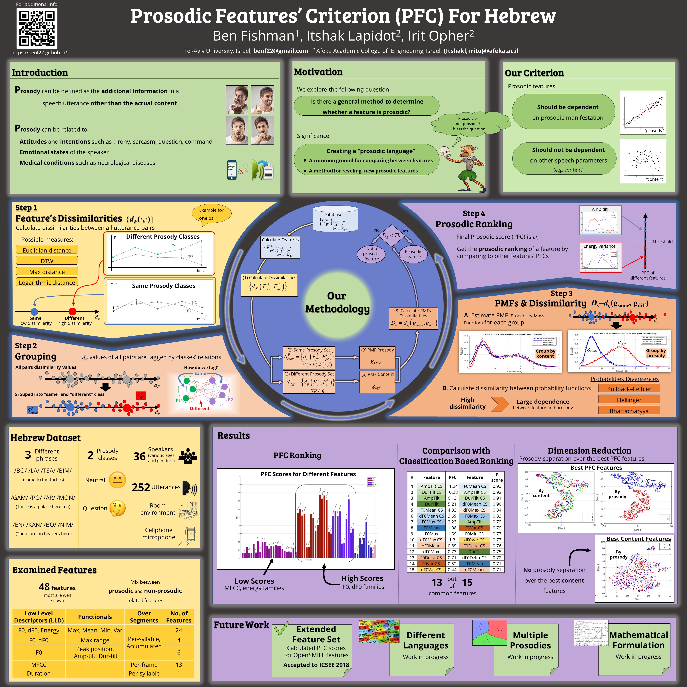

# What is prosody?
**Prosody** can be defined as the additional information in a speech utterance other than the actual content, for example: intonation and melody of a sentance, the rythm, loudnees, timbre and quality of the voice and much more.

When listening and understanding to prosody, we can understand the subtext of the sentance, for example:
     1. Attitudes and intentions such as : irony, sarcasm, question, command
     2. Emotional states of the speaker
     3. Medical conditions such as neurological diseases
     
# What we are trying to do?
We explore the question if here is a general method to determine whether a feature is prosodic?
We are trying to create a "Prosodic language" that can be a common ground to compare between different features and ranking them according the "amount" of prosodic information they carry.
## Our first steps...
As a first step we developed a criterion that can measure a feature and, determine whether it convey prosodic information and provide a numerical score for that feature


# Publications
## TSD - Text Speech & Dialouge conferance
_Ben Fishman, Itshak Lapidot, and Irit Opher, “Prosodic Features' Criterion For Hebrew”, Proceedings of Text, Speech, Dialogue-TSD conference, 2018_ [link](aaa)

!audio[ title ](  ){ size=10 duration=10  }

{::nomarkdown}

<center>
<table>
  <tr>
       <td style="text-align: center; vertical-align: middle;">Speaker / Phrase</td>
       <td style="text-align: center; vertical-align: middle;">Prosody 1 <br> <b>Neutral</b> </td>
       <td style="text-align: center; vertical-align: middle;">Prosody 2 <br><b>Question</b></td>
  </tr>
  <tr>
    <td style="text-align: center; vertical-align: middle;">Female, age: 21, phrase 1</td>
    <td style="text-align: center; vertical-align: middle;">
      <audio controls>
      <source src="noa_s1_p1.mp3" type="audio/mpeg">
      Browser doesn't support audio element
      </audio>
    </td>
    <td style="text-align: center; vertical-align: middle;">
      <audio controls>
      <source src="noa_s1_p2.mp3" type="audio/mpeg">
      Browser doesn't support audio element
      </audio>
    </td>     
  </tr>
  <tr>   
    <td style="text-align: center; vertical-align: middle;">Male, age: 55, phrase 2</td>
    <td style="text-align: center; vertical-align: middle;">
      <audio controls>
      <source src="Yossi_s2_p1.mp3" type="audio/mpeg">
      Browser doesn't support audio element
      </audio>
    </td>
    <td style="text-align: center; vertical-align: middle;">
      <audio controls>
      <source src="Yossi_s2_p2.mp3" type="audio/mpeg">
      Browser doesn't support audio element
      </audio>
    </td>   
  </tr>
  <tr>
    <td style="text-align: center; vertical-align: middle;">Female, age: 33, phrase 3</td>
    <td style="text-align: center; vertical-align: middle;">
      <audio controls>
      <source src="sivan_s3_p1.mp3" type="audio/mpeg">
      Browser doesn't support audio element
      </audio>
    </td>
    <td style="text-align: center; vertical-align: middle;">
      <audio controls>
      <source src="sivan_s3_p2.mp3" type="audio/mpeg">
      Browser doesn't support audio element
      </audio>
    </td>          
  </tr>
</table>
{:/}
     
     
Our poster:



```

Text can be **bold**, _italic_, or ~~strikethrough~~.

[Link to another page](./another-page.html).

There should be whitespace between paragraphs.

There should be whitespace between paragraphs. We recommend including a README, or a file with information about your project.

# Header 1

This is a normal paragraph following a header. GitHub is a code hosting platform for version control and collaboration. It lets you and others work together on projects from anywhere.

## Header 2

> This is a blockquote following a header.
>
> When something is important enough, you do it even if the odds are not in your favor.

### Header 3
```
```js
// Javascript code with syntax highlighting.
var fun = function lang(l) {
  dateformat.i18n = require('./lang/' + l)
  return true;
}
```

```ruby
# Ruby code with syntax highlighting
GitHubPages::Dependencies.gems.each do |gem, version|
  s.add_dependency(gem, "= #{version}")
end
```
```
#### Header 4

*   This is an unordered list following a header.
*   This is an unordered list following a header.
*   This is an unordered list following a header.

##### Header 5

1.  This is an ordered list following a header.
2.  This is an ordered list following a header.
3.  This is an ordered list following a header.

###### Header 6

| head1        | head two          | three |
|:-------------|:------------------|:------|
| ok           | good swedish fish | nice  |
| out of stock | good and plenty   | nice  |
| ok           | good `oreos`      | hmm   |
| ok           | good `zoute` drop | yumm  |

### There's a horizontal rule below this.

* * *

### Here is an unordered list:

*   Item foo
*   Item bar
*   Item baz
*   Item zip

### And an ordered list:

1.  Item one
1.  Item two
1.  Item three
1.  Item four

### And a nested list:

- level 1 item
  - level 2 item
  - level 2 item
    - level 3 item
    - level 3 item
- level 1 item
  - level 2 item
  - level 2 item
  - level 2 item
- level 1 item
  - level 2 item
  - level 2 item
- level 1 item

### Small image


### Large image


### Definition lists can be used with HTML syntax.

<dl>
<dt>Name</dt>
<dd>Godzilla</dd>
<dt>Born</dt>
<dd>1952</dd>
<dt>Birthplace</dt>
<dd>Japan</dd>
<dt>Color</dt>
<dd>Green</dd>
</dl>
```
```
Long, single-line code blocks should not wrap. They should horizontally scroll if they are too long. This line should be long enough to demonstrate this.
```

```
The final element.
```
